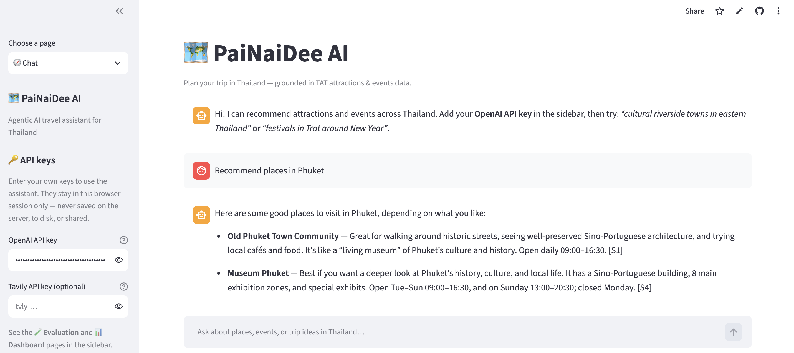
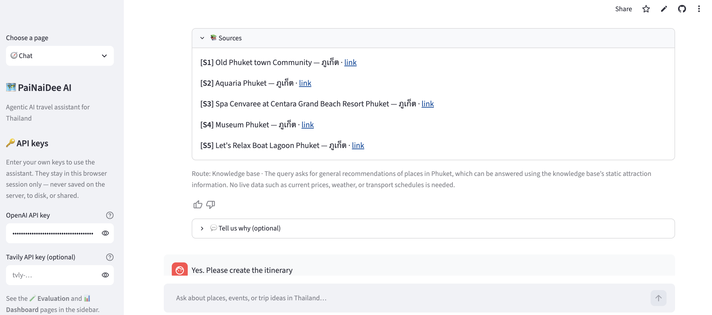
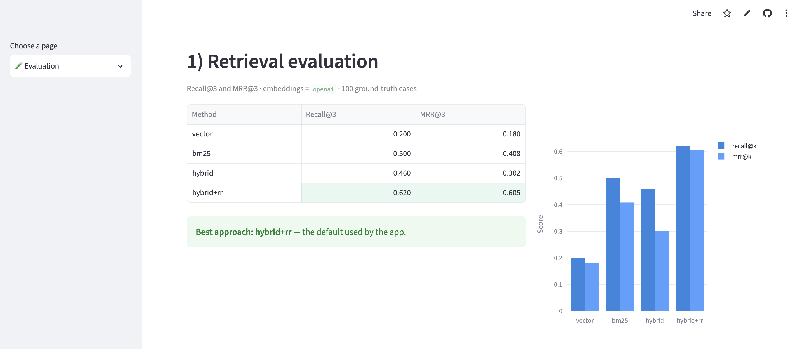
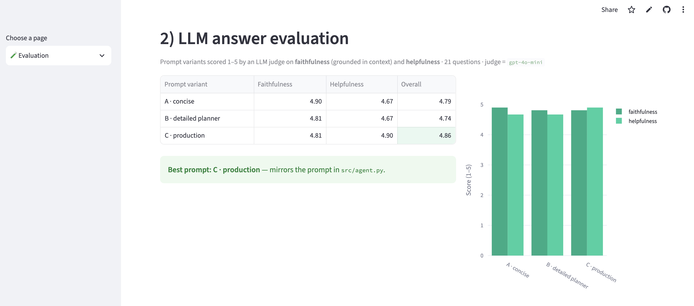
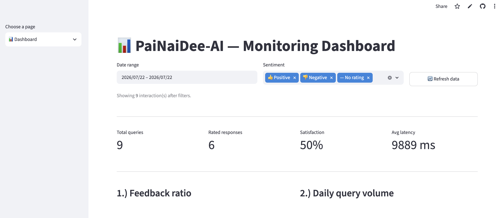
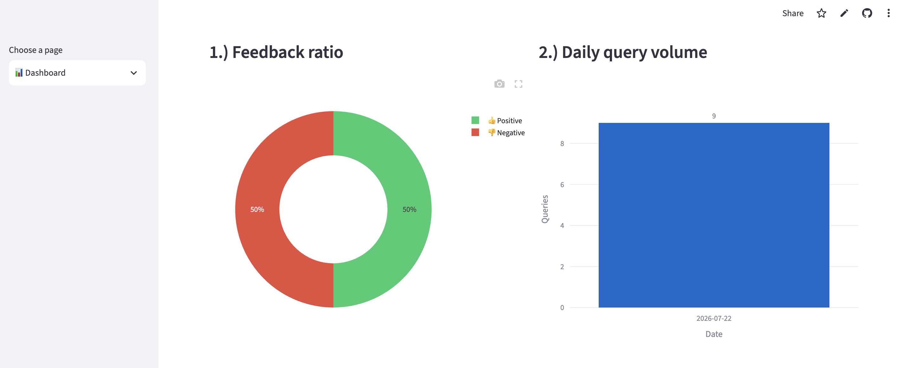
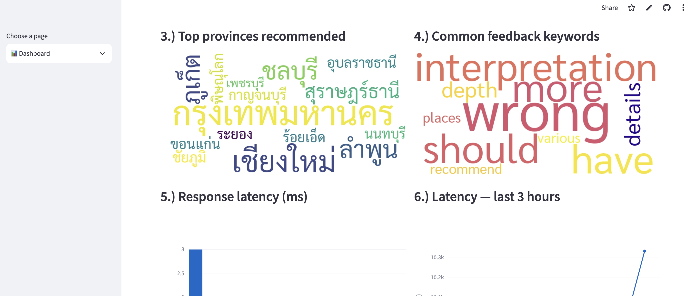
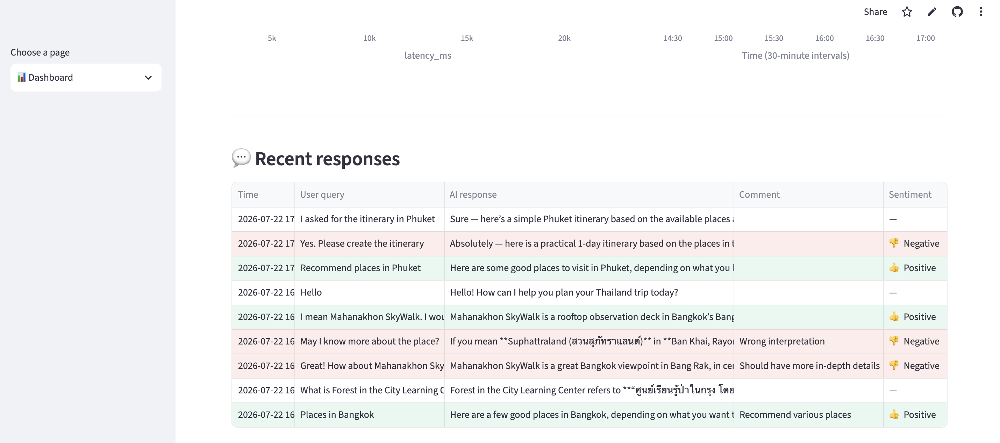

# PaiNaiDee-AI — Agentic RAG Travel Recommender for Thailand

PaiNaiDee-AI ("ไปไหนดี" = *"where should I go?"*) is an end-to-end **Agentic RAG**
application for planning trips in Thailand. It grounds answers in official
Tourism Authority of Thailand (TAT) data — **attractions** and **events** — and
optionally calls live **web search** when the knowledge base cannot cover
real-time facts. Answers are in English, with source citations.

**Try the live demo:** [https://painaidee-ai.streamlit.app/](https://painaidee-ai.streamlit.app/)  
(Enter your own OpenAI API key in the sidebar — keys stay in your browser session only.)

This README is written for reviewers who did **not** take the course. It explains
the problem, the data, the application flow, how to run everything, and where
each **evaluation criterion** is satisfied. See
[Evaluation criteria mapping](#evaluation-criteria-mapping).

---

## Table of contents

- [Problem description](#problem-description)
- [The data](#the-data)
- [Architecture and flow](#architecture-and-flow)
- [Project structure](#project-structure)
- [Quickstart (local)](#quickstart-local)
- [Quickstart (Docker)](#quickstart-docker)
- [Usage examples](#usage-examples)
- [Ingestion pipeline](#ingestion-pipeline)
- [Retrieval and best practices](#retrieval-and-best-practices)
- [Evaluation](#evaluation)
- [Interface](#interface)
- [Screenshots](#screenshots)
- [Monitoring and feedback](#monitoring-and-feedback)
- [Containerization](#containerization)
- [Deployment (Streamlit Cloud)](#deployment-streamlit-cloud)
- [Configuration reference](#configuration-reference)
- [Evaluation criteria mapping](#evaluation-criteria-mapping)
- [Reproducibility checklist](#reproducibility-checklist)

---

## Problem description

Planning a trip in Thailand means combining scattered information: *what* to see,
*where* it is, *when* events happen, and practical details (hours, contacts,
prices). Official TAT exports are rich but hard to query: Thai-heavy narrative
fields, HTML markup, free-text opening hours, and time-bound events mixed with
evergreen attractions. General chatbots often invent opening times and dates.

**PaiNaiDee-AI solves this** by grounding an LLM in TAT data:

- Ask in plain English (e.g. *"cultural riverside towns in eastern Thailand"* or
  *"festivals near Trat around New Year"*).
- The app retrieves relevant **attractions** and **events**, filters events by
  **province** and **date range**, re-ranks candidates, and returns a **cited**
  answer.
- For facts missing from the KB (live ticket prices, weather, transport), a
  **web-search tool** (Tavily) can run.
- Every answer can be rated 👍/👎 with an optional comment; usage feeds a
  **monitoring dashboard**.

The system is designed **not to invent** missing facts — it states uncertainty
and cites `[S#]` (knowledge base) or `[W#]` (web) sources.

---

## The data

JSON exports from the **Tourism Authority of Thailand (TAT)** live in `data/`:

| File | Entity | Records (raw) | Key fields |
|------|--------|---------------|------------|
| `attraction.json` | Static attractions | 8,634 | `ATT_NAME_TH/EN`, `ATT_DETAIL_TH` (HTML), `ATT_HILIGHT`, `ATT_LOCATION` (`lat, lng`), `PROVINCE_NAME_TH`, `ATT_CATEGORY_LABEL`, `ATT_START_END`, contacts |
| `activity.json` | Scheduled events | 20,334 | `NAME`, `DESCRIPTION` (HTML), `STARTDATE`, `ENDDATE`, `PROVINCE`, `LOCATION`, `EVENTTARGETGROUP`, `TATEVENTTYPENAME`, `TAT_HIGHLIGHT`, ticket prices, contacts |

### Data sources (official TAT Open Data)

| Dataset | Catalog page |
|---------|--------------|
| Tourist attractions | [ชุดข้อมูลแหล่งท่องเที่ยว](https://datacatalog.tat.or.th/dataset/tourist-attraction) |
| Tourism activities / events | [ชุดข้อมูลกิจกรรมท่องเที่ยว](https://datacatalog.tat.or.th/dataset/tourismactivity) |

Both are public Open Data Common datasets published by TAT (JSON downloads on
the catalog pages above). Place the downloaded files as
`data/attraction.json` and `data/activity.json`.

**Structure note:** each export is a single-key JSON object whose key is the
original SQL query and whose value is the row array. Ingestion unwraps this
automatically (`src/utils.py` → `load_tat_export`).

**Ingestion filters (smaller vector DB):** the full dumps are curated before
embedding so Chroma stays manageable:

| Source | Filter in `ingestion/ingest_pipeline.py` | Approx. kept |
|--------|------------------------------------------|--------------|
| Attractions | `ATT_HILIGHT is not None` | ~493 |
| Events | `TAT_HIGHLIGHT == "TRUE"` | ~451 |

**Cleaning handled by the pipeline:** HTML stripping, bilingual text, `"lat, lng"`
parsing, Oracle `LISTAGG` trailing commas, ISO dates + epoch-day metadata for
event filtering, and duplicate-ID / batch upserts.

---

## Architecture and flow

```
   data/*.json  ──►  Prefect ingestion (filter · clean · embed · metadata)
                              │
                              ▼
                    ChromaDB (attractions | events)
                              │
 user query ──► Query rewriting ──► Hybrid search (dense + BM25, RRF)
                                      + metadata filter (province, dates)
                                      ▼
                                   LLM re-ranking
                                      │
                         Router ──────┤ need real-time / weak KB?
                            │         ▼
                            │    Tavily web search (optional)
                            ▼
              Grounded prompt ──► OpenAI LLM ──► cited English answer
                                                      │
                                                      ▼
                               SQLite log + 👍/👎 feedback ──► Dashboard
```

**Stack:** Streamlit (multipage UI) · OpenAI (chat + embeddings) · ChromaDB ·
rank-bm25 · Tavily · Prefect · SQLite · Docker Compose · wordcloud / Plotly
(dashboard).

---

## Project structure

```text
.
├── data/
│   ├── attraction.json          # TAT attractions (from TAT Data Catalog)
│   └── activity.json            # TAT events (from TAT Data Catalog)
├── assets/
│   ├── fonts/
│   │   └── Sarabun-Regular.ttf  # Thai-capable font for word clouds
│   └── images/                  # README screenshots (Chat · Eval · Dashboard)
├── ingestion/
│   └── ingest_pipeline.py       # Prefect flow: filter → clean → embed → ChromaDB
├── src/
│   ├── config.py                # env-driven configuration
│   ├── utils.py                 # HTML strip, coord/date parse
│   ├── embeddings.py            # OpenAI (+ offline local) embeddings
│   ├── llm.py                   # OpenAI chat wrapper
│   ├── retrieval.py             # hybrid search, rewrite, filter, rerank
│   ├── agent.py                 # router + Tavily + answer synthesis
│   └── db.py                    # SQLite interaction / feedback store
├── eval/
│   ├── retrieval_eval.py        # vector vs bm25 vs hybrid vs hybrid+rr
│   ├── llm_eval.py              # prompts A / B / C + LLM judge
│   └── test_data/
│       ├── ground_truth.json    # labeled retrieval cases
│       └── questions.json       # LLM-eval question set
├── views/
│   ├── chat.py                  # Chat page (UI + feedback)
│   ├── evaluation.py            # Evaluation results page
│   └── dashboard.py             # Monitoring dashboard (6+ charts)
├── streamlit_app.py             # multipage entrypoint (Chat · Eval · Dashboard)
├── app.py                       # chat UI (standalone)
├── dashboard.py                 # dashboard (standalone)
├── Dockerfile
├── docker-compose.yml           # ingest → app → dashboard
├── requirements.txt             # pinned dependency versions
├── .env.example
├── .streamlit/
│   ├── config.toml
│   └── secrets.toml.example
└── README.md
```

---

## Quickstart (local)

**Prerequisites:** Python 3.10+.

```bash
# 1. Clone and enter
git clone <your-repo-url> && cd PaiNaiDee-AI

# 2. Virtual env + pinned dependencies
python -m venv .venv && source .venv/bin/activate
pip install -r requirements.txt

# 3. Optional: CLI / Docker keys only (ingest + eval). The chat UI does NOT
#    read these — each user pastes keys in the sidebar (session-only).
cp .env.example .env
# Edit .env if you will run ingestion or eval from the command line.

# 4. Ensure TAT JSON files are in data/ (see Data sources above)

# 5. Ingest into ChromaDB (Prefect-orchestrated; applies highlight filters).
#    Uses OPENAI_API_KEY from .env via load_cli_keys_from_env().
python -m ingestion.ingest_pipeline

# 6. Multipage app (Chat · Evaluation · Dashboard)
streamlit run streamlit_app.py   # → http://localhost:8501
#    Paste your OpenAI (and optional Tavily) key in the sidebar to chat.
```

Standalone alternatives:

```bash
streamlit run app.py             # chat only
streamlit run dashboard.py       # dashboard only
```

**API keys in the UI:** OpenAI (required) and Tavily (optional) are entered in the
Chat sidebar. They live in `st.session_state` only — not written to disk,
`.env`, or Streamlit secrets, and not kept as server-side defaults.

---

## Quickstart (Docker)

Full stack via Docker Compose (ingestion → Streamlit app → dashboard), with
shared volumes for Chroma and SQLite:

```bash
cp .env.example .env     # keys for the ingest service only
docker compose up --build
```

Chat users still enter their own OpenAI / Tavily keys in the app sidebar.

| Service | URL |
|---------|-----|
| Chat app (`app.py`) | http://localhost:8501 |
| Dashboard (`dashboard.py`) | http://localhost:8502 |

The `ingest` service runs once and must succeed before `app` starts.

---

## Usage examples

| You ask | What happens |
|---------|--------------|
| *"Recommend a cultural riverside old town in eastern Thailand."* | Query rewrite → hybrid retrieval on attractions → re-rank → cited answer. |
| *"Any festivals in Trat around New Year?"* | Rewriter extracts province + date window → event metadata filter → cited event. |
| *"How much is a ticket to the Phuket Boat Show right now?"* | Router may trigger **Tavily**; answer blends KB + web with `[W#]` citations. |

Each reply shows a **Sources** expander, a route caption (KB vs KB+Web), and
👍/👎 feedback with an optional comment.

---

## Ingestion pipeline

Automated ingestion with **Prefect** (`ingestion/ingest_pipeline.py`, flow
`painaidee-ingestion`):

1. **Load & filter** — unwrap SQL-keyed JSON; keep only highlighted records
   (`ATT_HILIGHT` for attractions, `TAT_HIGHLIGHT == TRUE` for events) so the
   vector DB stays smaller than the full dump.
2. **Normalize** — strip HTML (BeautifulSoup), parse coordinates/dates, build
   bilingual documents, attach filterable metadata.
3. **Build collections** — embed with OpenAI `text-embedding-3-small` (or local
   backend), upsert into Chroma collections `attractions` and `events` (batched,
   de-duplicated by ID).

```bash
python -m ingestion.ingest_pipeline          # reset + rebuild
python -m ingestion.ingest_pipeline --no-reset
```

`run_ingestion()` is a Prefect-free path used by the Streamlit app for cold-start
auto-ingest (useful on Streamlit Cloud).

---

## Retrieval and best practices

Implemented in `src/retrieval.py` and used by `src/agent.py`:

| Best practice | Implementation |
|---------------|----------------|
| **Hybrid search** | Dense (Chroma) + BM25 (`rank-bm25`), fused with Reciprocal Rank Fusion |
| **Document re-ranking** | LLM scores candidates 0–10 and reorders top-k |
| **User query rewriting** | LLM rewrites search terms and extracts province / date / source filters |

Also included: **metadata filtering** (event date-range overlap + province) with
fallback if a strict filter returns empty.

The live app default is **query rewrite → hybrid search → re-ranking**, which
won the retrieval evaluation (`hybrid+rr`).

The router in `src/agent.py` decides whether to call **Tavily**, then synthesizes
a grounded English answer with `[S#]` / `[W#]` citations.

---

## Evaluation

Multiple approaches are compared; the best ones are used in the app.

### Retrieval evaluation

```bash
python -m eval.retrieval_eval
```

Compares four methods on `eval/test_data/ground_truth.json`:

| Method | Recall@3 | MRR@3 |
|--------|----------|-------|
| vector | 0.200 | 0.180 |
| bm25 | 0.500 | 0.408 |
| hybrid | 0.460 | 0.302 |
| **hybrid+rr** | **0.620** | **0.605** |

**Best approach: `hybrid+rr`** — used as the app default.

Results are also shown on the **🧪 Evaluation** page (`views/evaluation.py`).
See [Screenshots → Evaluation](#evaluation-1).

### LLM evaluation

```bash
python -m eval.llm_eval    # requires OPENAI_API_KEY
```

Compares **three** system prompts on the same retrieved context, scored by an
LLM judge (faithfulness + helpfulness, 1–5). Questions live in
`eval/test_data/questions.json`.

#### Prompt variants (`eval/llm_eval.py`)

**A · concise**

```text
You are PaiNaiDee, a Thailand travel assistant. Answer in English, concisely
(2-4 sentences). Use ONLY the provided context and cite sources as [S#].
Do not invent details.
```

**B · detailed planner**

```text
You are PaiNaiDee, an expert Thailand trip planner. Answer in English with a
short intro then bullet points (name, why to go, practical tip). Use ONLY the
provided context and cite sources as [S#]. If a detail is missing, say so.
```

**C · production** (mirrors `src/agent.py` `_ANSWER_SYS`)

```text
You are PaiNaiDee, a friendly Thailand travel assistant. Answer in English.
Use ONLY the provided context and cite every claim with its tag, e.g. [S1].
If the context lacks specific details (exact price, current hours,
availability), say so honestly instead of inventing them. Recommend concrete
places/events and briefly explain why. Be concise and practical.
```

#### Results

| Variant | Faithfulness | Helpfulness | Overall |
|---------|--------------|-------------|---------|
| A · concise | 4.90 | 4.67 | 4.79 |
| B · detailed planner | 4.81 | 4.67 | 4.74 |
| **C · production** | 4.81 | **4.90** | **4.86** |

**Best prompt: C · production** — this is the system prompt used in the live app
(`src/agent.py`).

> Large question sets are expensive (many sequential OpenAI calls). Prefer a
> modest `questions.json` for routine runs; the Evaluation page stores the
> reported numbers for demos without re-running the API.

---

## Interface

Streamlit multipage UI. Main entrypoint: `streamlit run streamlit_app.py`

**Live demo:** [https://painaidee-ai.streamlit.app/](https://painaidee-ai.streamlit.app/)

| Page | Module | Role |
|------|--------|------|
| 🧭 Chat | `views/chat.py` | Conversational recommender + feedback |
| 🧪 Evaluation | `views/evaluation.py` | Retrieval + LLM eval tables / charts |
| 📊 Dashboard | `views/dashboard.py` | Monitoring KPIs and charts |

---

## Screenshots

### Chat

Cited recommendations grounded in the TAT knowledge base; optional Tavily web
search; 👍/👎 feedback. Paste your own API keys in the sidebar (session-only).





### Evaluation

Precomputed retrieval and LLM-prompt comparisons (same numbers as the tables
above).





### Dashboard

Filters, KPIs, six charts (including Thai word clouds), and a recent-responses
table.









---

## Monitoring and feedback

### Feedback collection

In Chat, each answer supports:

- Streamlit `st.feedback` 👍 / 👎
- Optional free-text comment

Stored in SQLite (`feedback.db`) via `src/db.py`: query, response, route,
provinces, latency, rating, comment, timestamp.

### Dashboard (≥6 visuals)

`views/dashboard.py` / `dashboard.py`:

1. Positive vs negative feedback (donut)
2. Daily query volume (vertical bar chart, date on X-axis)
3. Top provinces recommended (**word cloud**, Thai font)
4. Common feedback keywords (**word cloud**)
5. Response latency distribution (histogram)
6. Average latency — last 3 hours, 30-minute buckets (line)

Plus:

- Top filters: **date range** + **sentiment**
- **Refresh data** button
- **Recent response** table (every logged query + AI answer, not only commented rows)

See [Screenshots → Dashboard](#dashboard) for the live UI.

---

## Containerization

| Artifact | Role |
|----------|------|
| `Dockerfile` | Streamlit application image |
| `docker-compose.yml` | `ingest` → `app` → `dashboard` with shared volumes |

See [Quickstart (Docker)](#quickstart-docker).

---

## Deployment (Streamlit Cloud)

**Live app:** [https://painaidee-ai.streamlit.app/](https://painaidee-ai.streamlit.app/)

The app uses **embedded ChromaDB** (no separate DB server):

1. Push the repo to GitHub.
2. Create a Streamlit Cloud app with **Main file path = `streamlit_app.py`**.
3. Deploy **without** putting API keys in Cloud Secrets — each visitor pastes
   their OpenAI (and optional Tavily) key in the Chat sidebar. Keys stay in that
   browser session only.
4. Prefer a pre-built `chroma_db` in the deployment (or run CLI ingest elsewhere)
   so cold start does not depend on a server-side key. If the index is missing,
   the first user who enters an OpenAI key can trigger auto-ingest for that
   session’s embedding backend.

Optional non-secret overrides (model names, paths) may go in Streamlit secrets;
see `.streamlit/secrets.toml.example`.

The Evaluation page uses precomputed numbers so it does not call the eval APIs
live.

---

## Configuration reference

**Chat UI keys (not env):** users enter `OPENAI_API_KEY` and optional
`TAVILY_API_KEY` in the sidebar. `src/config.py` starts those values empty and
never loads them from the server environment for the app.

**CLI / Docker only** (`.env` → `config.load_cli_keys_from_env()` for ingest &
eval):

| Variable | Default | Purpose |
|----------|---------|---------|
| `OPENAI_API_KEY` | — | Required for CLI ingest / eval |
| `TAVILY_API_KEY` | — | Optional for CLI web-search tests |
| `OPENAI_CHAT_MODEL` | see `src/config.py` | Chat model |
| `OPENAI_EMBEDDING_MODEL` | `text-embedding-3-small` | Embedding model |
| `EMBEDDING_BACKEND` | `openai` | `openai` or `local` (offline test) |
| `CHROMA_DIR` | `./chroma_db` | Vector store path |
| `FEEDBACK_DB` | `./feedback.db` | SQLite feedback DB |
| `DATA_DIR` | `./data` | Source JSON directory |

Dependency versions are pinned in `requirements.txt`.

---

## Evaluation criteria mapping

| Criterion | Where in this project |
|-----------|------------------------|
| **Problem description** | [Problem description](#problem-description) |
| **Retrieval flow** (KB + LLM) | `src/retrieval.py`, `src/agent.py`, ChromaDB |
| **Retrieval evaluation** (multiple approaches; best used) | `eval/retrieval_eval.py`, `eval/test_data/ground_truth.json`; app uses **hybrid+rr** |
| **LLM evaluation** (multiple approaches; best used) | `eval/llm_eval.py` (prompts A/B/C); app uses **prompt C** in `src/agent.py` |
| **Interface** | Streamlit multipage UI — `streamlit_app.py`, `views/` |
| **Ingestion pipeline** | Prefect flow — `ingestion/ingest_pipeline.py` (with highlight filters) |
| **Monitoring** (feedback + ≥5 charts) | Chat feedback + `views/dashboard.py` (6 charts + table) |
| **Containerization** | `Dockerfile` + `docker-compose.yml` (ingest, app, dashboard) |
| **Reproducibility** | This README, pinned `requirements.txt`, TAT catalog links + `data/` |
| **Hybrid search** | `src/retrieval.py` (`hybrid_search`) + retrieval eval |
| **Document re-ranking** | `src/retrieval.py` (`rerank`) + retrieval eval |
| **User query rewriting** | `src/retrieval.py` (`rewrite_query`) |
| **Bonus: cloud deployment** | [Streamlit Cloud](#deployment-streamlit-cloud) |

---

## Reproducibility checklist

1. Clone the repo and use Python 3.10+.
2. `pip install -r requirements.txt` (versions pinned).
3. For CLI ingest/eval only: copy `.env.example` → `.env` and set API keys.
4. Download TAT JSON from the [attraction](https://datacatalog.tat.or.th/dataset/tourist-attraction) and [activity](https://datacatalog.tat.or.th/dataset/tourismactivity) catalog pages into `data/attraction.json` and `data/activity.json` (or use the copies already in the repo if present).
5. Run `python -m ingestion.ingest_pipeline` (applies highlight filters; uses `.env` keys).
6. Run `streamlit run streamlit_app.py` and paste your OpenAI key in the sidebar.
7. Optional quality checks:
   - `python -m eval.retrieval_eval`
   - `python -m eval.llm_eval`
8. Or: `docker compose up --build`.

---

## Data attribution

Tourism data © **Tourism Authority of Thailand (TAT)**, published via the
[TAT Data Catalog](https://datacatalog.tat.or.th/) under Open Data Common:

- [Tourist attractions](https://datacatalog.tat.or.th/dataset/tourist-attraction)
- [Tourism activities](https://datacatalog.tat.or.th/dataset/tourismactivity)

Included for educational / demo purposes.
